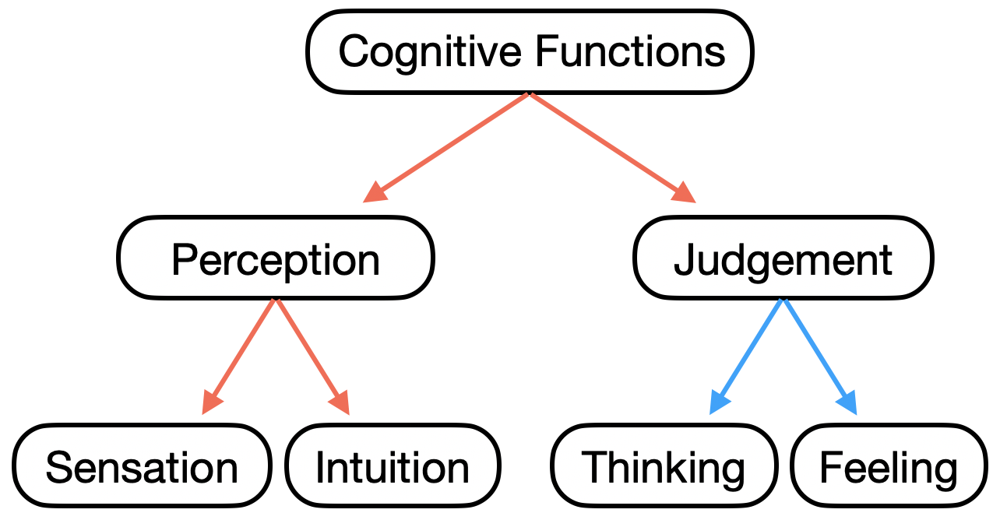

# Predicting-Personality-from-Text-An-Analysis-of-Multi-Label-Classification-Methods

Carl Jung, founder of the field of analytical psychology, formulated a personality theory aiming to categorize people based on how they process information. He identified two types of cognitive functions: two perception functions known as sensation and intuition, and two judgement functions known as thinking and feeling. The functions within each pair are considered to be opposites of each other. 

  

Additionally, these four functions operate in conjunction with either an introverted or extroverted attitude. This results in eight functional variations, or personality types: extroverted sensing (Se), introverted sensing(Si), extroverted intuition (Ne), introverted intuition (Ni), extroverted feeling (Fe), introverted feeling (Fi), extroverted thinking (Te), and introverted thinking (Ti). 

All four cognitive functions are used at different times depending on the circumstances. However, one of the four functions tend to be used more frequently than the other three in a more conscious and confident way. This dominant function is supported by two auxiliary functions. The dominant and first auxiliary are referred to as the two primary cognitive functions, and are of different cognitive function type: for example, if the dominant function is a judging type, then the first auxillary will be a perceiving type and vice versa. The fourth and least conscious function, often referred to as the inferior function, is always the opposite of the dominant function in terms of cognitive function and attitude. For example, an extroverted thinking dominant function would be balanced by an introverted feeling inferior function. Jung theorized that the dominant function characterizes conscious behavior, while the inferior function is repressed and characterizes unconscious behavior.

Jung's personality theory formed the basis of the Myers-Briggs Type Indicator (MBTI) which is a widely used method of self-categorization of personality type through an introspective questionnaire. The relationships between MBTI type and Jungian cognitive functions are shown below. Primary cognitive functions are highlighted in green.

 

INTP = Ti > Ne > Si > Fe  

ISTP = Ti > Se > Ni > Fe  

ENTP = Ne > Ti > Fe > Si  

ENFP = Ne > Fi > Te > Si  

ISFP = Fi > Se > Ni > Te  

INFP = Fi > Ne > Si > Te  

INTJ = Ni > Te > Fi > Se  

INFJ = Ni > Fe > Ti > Se  

ESTJ = Te > Si > Ne > Fi  

ENTJ = Te > Ni > Se > Fi  

ESFJ = Fe > Si > Ne > Ti  

ENFJ = Fe > Ni > Se > Ti  

ISTJ = Si > Te > Fi > Ne  

ISFJ = Si > Fe > Ti > Ne  

ESTP = Se > Ti > Fe > Ni  

ESFP = Se > Fi > Te > Ni  

